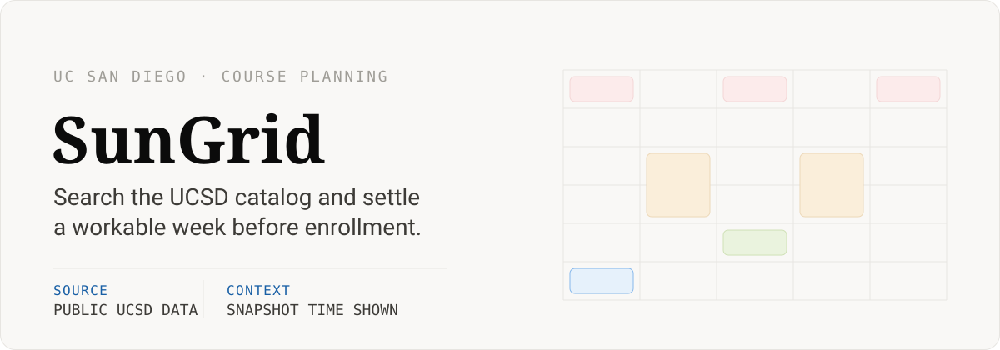
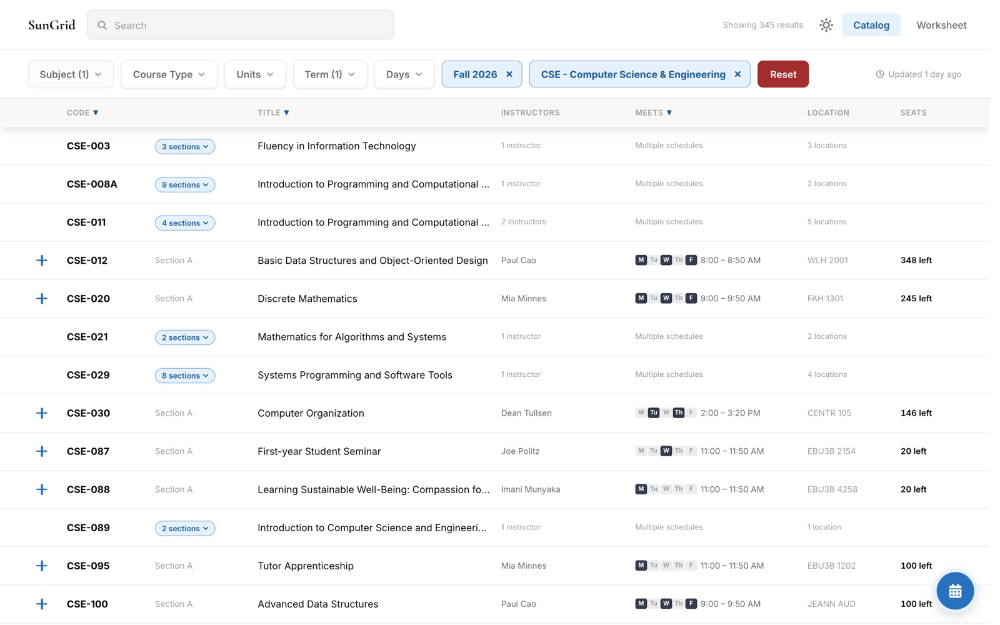
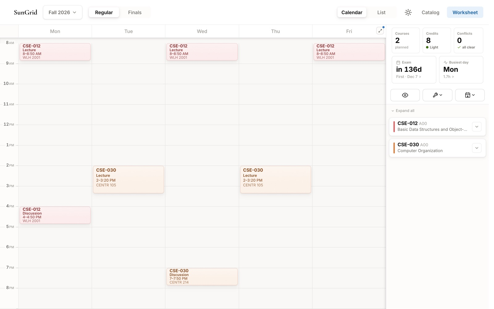
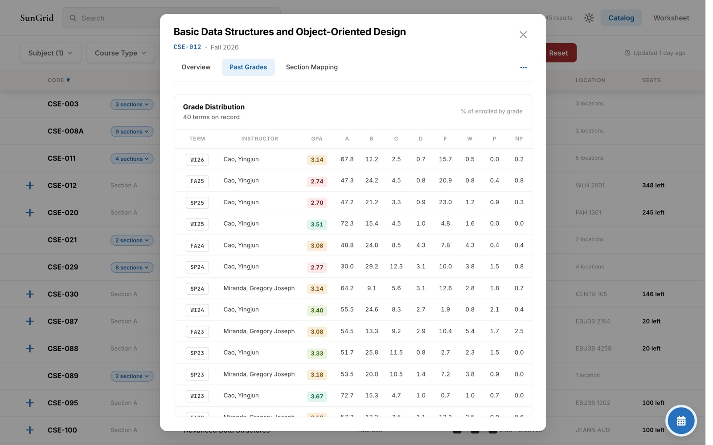
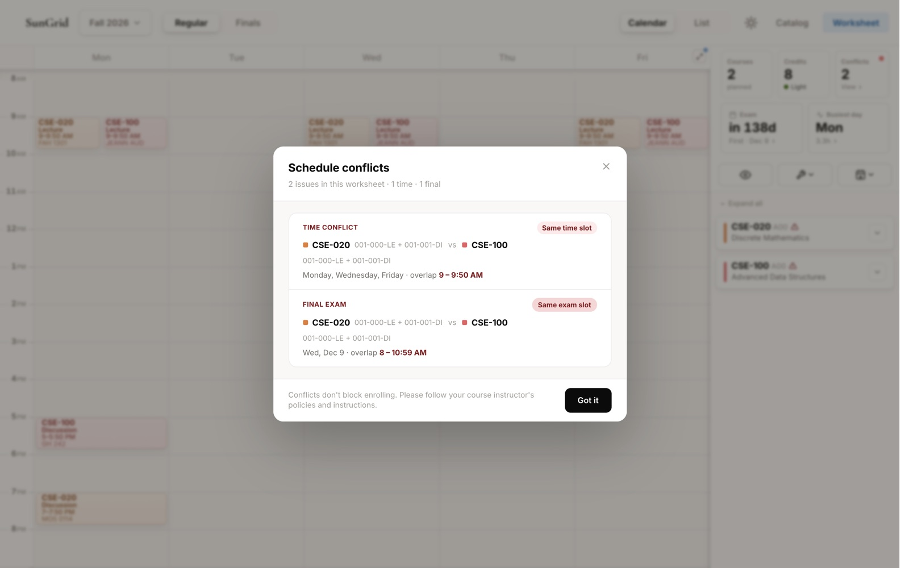
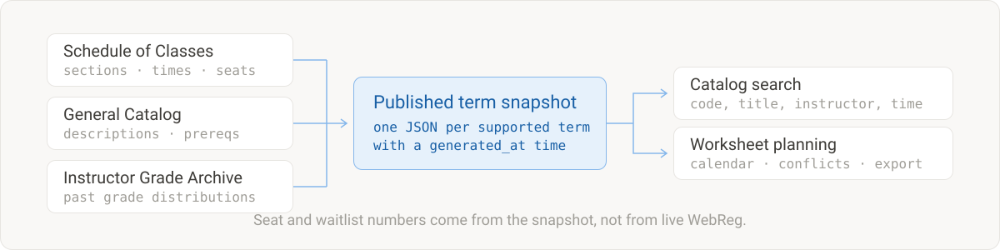

  <strong>English</strong> · <a href="./README.zh-CN.md">简体中文</a>

  

  <strong>Search the UCSD catalog, compare real section details, and settle a workable week before enrollment.</strong> 
  Free to browse. No account required.

  <a href="https://sungridplanner.com/catalog">Open the planner</a> ·
  <a href="https://sungridplanner.com/tutorial">View the tutorial</a> ·
  <a href="https://tally.so/r/q47EA8">Send feedback</a>

Every screenshot below is the running product on Fall 2026 data.

  

Filters narrow 345 results down to the sections that could actually fit. Meeting
days, times, rooms, and seats sit on the row itself, so comparing offerings does
not mean opening fifteen tabs.

  

Sections you add land on a five-day grid, with credits, the first exam date, and
a conflict count next to it.

  

Discovery and schedule building stay in the same loop. You search, open the
offering you actually want, add one of its sections, and keep going until the
week either works or clearly does not.

| Step    | What the product gives you                                                                                                                  |
| ------- | ------------------------------------------------------------------------------------------------------------------------------------------- |
| Search  | Code, title, instructor, subject, building, day, time, level, units, enrollment range, and course attributes                                |
| Inspect | Descriptions, prerequisites, restrictions, instructors, meeting patterns, source links, snapshot availability, and past grade distributions |
| Build   | Calendar or list view, supported worksheet terms, credits and exam dates, hidden courses, adjustable colors                                 |
| Keep    | A shareable worksheet URL, an `.ics` export for Apple, Google, or Outlook, and the weekly grid as a PNG                                     |

  

The course modal keeps the decision material in one place: what the course
covers, who teaches which section, how the sections map to each other, and how
past terms actually graded.

  

Conflicts are named rather than implied. Both lecture overlap and shared final
exam slots are reported, with the days and hours that collide.

  

  

Course information is assembled from three public UCSD sources: the Schedule of
Classes, the General Catalog, and the Instructor Grade Archive. They become one
published snapshot per supported term, which is what keeps search fast and each
term reproducible.

Anything tied to a snapshot shows when the snapshot was published, so a number
from last night reads differently from a number kept for a term that has already
closed.

> Enrollment, capacity, seat, and waitlist values are snapshot-based, not live
> WebReg data. Confirm official course information and availability in UCSD
> systems before you enroll.

  

Open the catalog and start adding sections. Nothing in basic course discovery or
planning waits behind a sign-up form. While signed out, the worksheet lives in
the current browser, and a supported share URL can restore the sections it
holds.

Students who verify a `@ucsd.edu` address keep account-owned worksheets and
saved filters across sessions. Account data stays separate from the
browser-local worksheet: signing in does not silently import, merge, or erase
the local plan.

  <a href="https://sungridplanner.com/catalog"><strong>sungridplanner.com/catalog</strong></a>

## Where the boundary is

This planner does not enroll students, scrape personal UCSD accounts, track
seats or demand in real time, publish SET/CAPE results, write directly to Google
Calendar, or add social permission controls to worksheets.

It is an independent service and not an official UC San Diego product. UC San
Diego names and source links identify the institution and the public information
sources only.

New original contributions first published with or after the current license
change are not licensed for public reuse. Third-party and previously released
portions remain subject to their applicable terms. See [`LICENSE`](./LICENSE)
for details.
