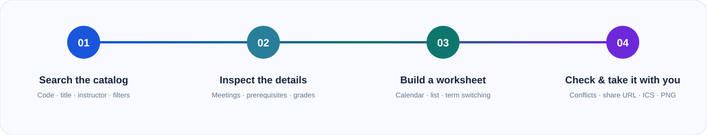

  <strong>English</strong> · <a href="./README.zh-CN.md">简体中文</a>

  

  <strong>Search the UCSD catalog, compare real section details, and shape a workable week before enrollment.</strong> 
  Free to browse. No account required.

  <a href="https://sungridplanner.com/catalog">Open the planner</a> ·
  <a href="https://sungridplanner.com/tutorial">View the tutorial</a> ·
  <a href="https://tally.so/r/q47EA8">Read the FAQ</a>

## From course search to a workable week

The planner keeps discovery and schedule building in one loop. Search across the
UCSD catalog, inspect the offering you actually want, add its section to a
worksheet, then resolve collisions before they reach your enrollment window.

  

## What you can do

| Find the right course                                                                                                   | Understand the offering                                                                                                                                   | See the whole week                                                                                                                                | Keep or share the plan                                                                                                     |
| ----------------------------------------------------------------------------------------------------------------------- | --------------------------------------------------------------------------------------------------------------------------------------------------------- | ------------------------------------------------------------------------------------------------------------------------------------------------- | -------------------------------------------------------------------------------------------------------------------------- |
| Search by code, title, instructor, subject, building, day, time, level, units, enrollment range, and course attributes. | Review descriptions, prerequisites, restrictions, instructors, meeting patterns, source links, snapshot availability, and historical grade distributions. | Build a calendar or list, switch supported worksheet terms, see credits and exams, flag time or final conflicts, hide courses, and adjust colors. | Copy a shareable worksheet URL, export an `.ics` calendar for Apple, Google, or Outlook, or save the weekly grid as a PNG. |

## Browse first. Sign in when it helps.

Basic course discovery and planning work without an account. While signed out,
the worksheet stays in the current browser and supported share URLs can restore
the selected sections.

Students who verify a `@ucsd.edu` address can keep account-owned worksheets and
saved filters across sessions. Account data is separate from the browser-local
worksheet: signing in does not silently import, merge, or erase the local plan.

## Data with its context attached

Course information is assembled from public UCSD sources:

- UCSD Schedule of Classes
- UCSD General Catalog
- UCSD Instructor Grade Archive

Published catalog snapshots make search fast and keep each supported term
reproducible. Availability surfaces show when their snapshot was published so
you can distinguish fresh planning context from historical records.

> Enrollment, capacity, seat, and waitlist values are snapshot-based—not live
> WebReg data. Always confirm official course information and availability in
> UCSD systems before enrolling.

## Know the boundary

This planner does not enroll students, scrape personal UCSD accounts, provide
real-time seat or demand tracking, publish SET/CAPE results, write directly to
Google Calendar, or add social/friend permission controls to worksheets.

It is an independent service and is not an official UC San Diego product or
service. UC San Diego names and source links identify the institution and the
public information sources only.

New original contributions first published with or after the current license
change are not licensed for public reuse. Third-party and previously released
portions remain subject to their applicable terms. See [`LICENSE`](./LICENSE)
for details.
