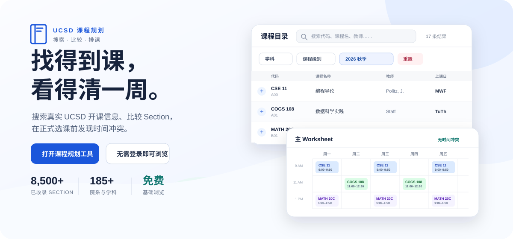
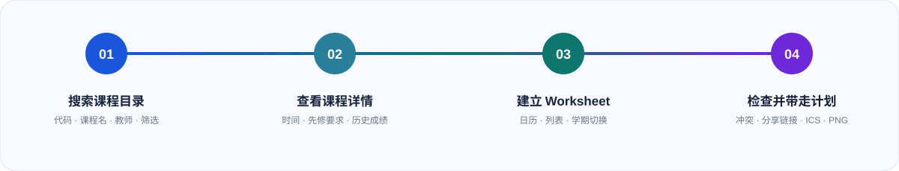

  <a href="./README.md">English</a> · <strong>简体中文</strong>

  

  <strong>搜索 UCSD 课程、比较真实班次信息，在正式选课前把一周课表排清楚。</strong> 
  免费浏览，无需注册账号。

  <a href="https://sungridplanner.com/catalog">打开课程规划工具</a> ·
  <a href="https://sungridplanner.com/tutorial">查看使用教程</a> ·
  <a href="https://tally.so/r/q47EA8">阅读常见问题</a>

## 从找课到排出可用的一周

课程探索和课表规划在同一条流程里完成：先搜索 UCSD 课程目录，查看想选的
具体开课班次，把 Section 加入 Worksheet（课表工作区），再在选课窗口到来前
发现并处理时间冲突。

  

## 你可以做什么

| 找到合适的课                                                                                   | 看懂具体开课信息                                                                               | 看清完整一周                                                                                         | 保存或分享计划                                                                                          |
| ---------------------------------------------------------------------------------------------- | ---------------------------------------------------------------------------------------------- | ---------------------------------------------------------------------------------------------------- | ------------------------------------------------------------------------------------------------------- |
| 按课程代码、名称、教师、学科、教学楼、日期、时间、课程级别、学分、选课人数区间和课程属性搜索。 | 查看课程描述、先修要求、限制条件、教师、上课安排、来源链接、快照时点的名额信息和历史成绩分布。 | 使用日历或列表排课，切换支持规划的学期，查看学分与考试，发现上课或期末考试冲突，隐藏课程并调整颜色。 | 复制可分享的 Worksheet 链接，导出适用于 Apple、Google 或 Outlook 的 `.ics` 日历，或把周课表保存为 PNG。 |

## 先直接使用，需要时再登录

基础找课和排课不要求账号。未登录时，Worksheet 保存在当前浏览器中；受支持
的分享链接可以恢复其中选择的 Section。

通过 `@ucsd.edu` 邮箱验证后，可以跨会话保存账号所属的 Worksheet 和搜索
筛选。账号数据与浏览器本地课表彼此独立：登录不会悄悄导入、合并或清空
本地计划。

## 数据要连同时间背景一起看

课程信息来自 UCSD 的公开来源：

- UCSD Schedule of Classes
- UCSD General Catalog
- UCSD Instructor Grade Archive

系统通过定期发布的课程快照实现快速搜索，并让每个受支持学期的数据可以
复现。涉及名额的信息会显示快照发布时间，帮助你区分近期规划信息和历史记录。

> 已选人数、容量、剩余名额和候补人数来自数据快照，并不是 WebReg 实时数据。
> 正式选课前，请始终通过 UCSD 官方系统确认课程信息和实际名额。

## 使用边界

本工具不会替学生执行选课，不会抓取个人 UCSD 账号，不提供实时名额或需求
追踪，不发布 SET/CAPE 结果，不会直接写入 Google Calendar，也不提供好友或
社交式的 Worksheet 权限控制。

这是独立服务，并非 UC San Diego 官方产品或服务。文中出现的 UC San Diego
名称和来源链接仅用于说明相关机构及公开信息来源。

在当前许可变更之后首次发布的原创贡献不开放公众复用。第三方内容和此前已经
发布的部分仍受各自适用条款约束。详情请参阅 [`LICENSE`](./LICENSE)。
