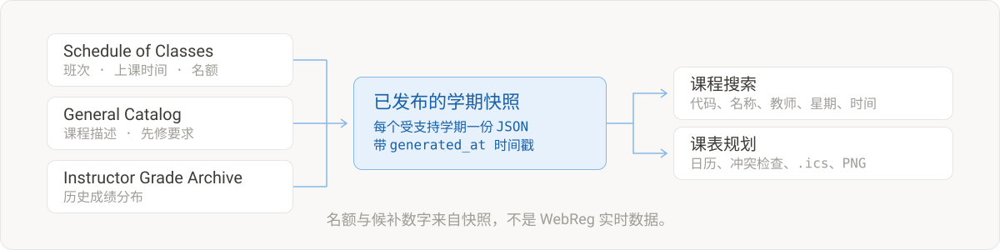

  <a href="./README.md">English</a> · <strong>简体中文</strong>

  

  <strong>搜索 UCSD 课程目录，比较真实的开课班次，在选课窗口打开之前把一周课表排清楚。</strong> 
  免费浏览，无需注册账号。

  

  <a href="https://sungridplanner.com/tutorial">查看使用教程</a> ·
  <a href="https://tally.so/r/q47EA8">反馈问题</a>

下面的截图都来自实际运行的产品，数据为 Fall 2026 学期。

  

筛选把 345 条结果收敛到真正排得进课表的班次。上课星期、时间、教室和名额就在同一行上，比较开课信息不需要开十几个标签页。

  

加入的 Section 会落到五天的网格里，旁边同时显示学分、最近一场考试的日期和冲突数量。

  

找课和排课始终在同一条流程里：搜索、打开真正想选的那门课、加入它的某个 Section，然后继续往下排，直到这一周排得通、或者明显排不通。

| 环节 | 产品里能做到的                                                                               |
| ---- | -------------------------------------------------------------------------------------------- |
| 搜索 | 按课程代码、名称、教师、学科、教学楼、星期、时间、课程级别、学分、选课人数区间和课程属性检索 |
| 查看 | 课程描述、先修要求、限制条件、教师、上课安排、来源链接、快照时点的名额信息、历史成绩分布     |
| 排课 | 日历视图或列表视图、切换受支持的规划学期、学分与考试日期、隐藏课程、调整颜色                 |
| 保留 | 可分享的 Worksheet 链接、适用于 Apple / Google / Outlook 的 `.ics` 日历、周课表 PNG          |

  

课程弹窗把做决定需要的材料放在一处：这门课讲什么、哪位教师带哪个 Section、各 Section 之间怎么对应，以及过去几个学期实际的给分情况。

  

冲突会被直接点名，而不是让你自己看出来。上课时间重叠和期末考试撞场都会列出，并标注具体重叠的星期和时段。

  

  

课程信息来自三个 UCSD 公开来源：Schedule of Classes、General Catalog 和 Instructor Grade Archive。它们汇成每个受支持学期一份的已发布快照，搜索因此足够快，每个学期的数据也可以复现。

凡是依赖快照的信息都会显示快照的发布时间：昨晚生成的数字，和一个已经结束的学期留下的数字，读起来不应该是一回事。

> 已选人数、容量、剩余名额和候补人数都来自数据快照，不是 WebReg 实时数据。
> 正式选课前，请通过 UCSD 官方系统确认课程信息和实际名额。

  

打开 SunGrid 就可以直接开始加课。基础的找课和排课不会卡在注册表单后面。未登录时，Worksheet 保存在当前浏览器中，受支持的分享链接可以恢复其中选择的 Section。

通过 `@ucsd.edu` 邮箱验证之后，账号所属的 Worksheet 和搜索筛选可以跨会话保留。账号数据与浏览器本地课表彼此独立：登录不会悄悄导入、合并或清空本地计划。

  

## 使用边界

本工具不会替学生执行选课，不会抓取个人 UCSD 账号，不提供实时名额或需求追踪，不发布 SET/CAPE 结果，不会直接写入 Google Calendar，也不提供社交式的 Worksheet 权限控制。

这是独立服务，并非 UC San Diego 官方产品。文中出现的 UC San Diego 名称和来源链接仅用于说明相关机构及公开信息来源。

在当前许可变更之后首次发布的原创贡献不开放公众复用。第三方内容和此前已经发布的部分仍受各自适用条款约束。详情请参阅 [`LICENSE`](./LICENSE)。
